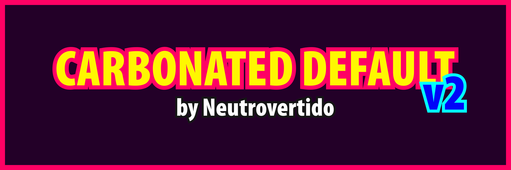
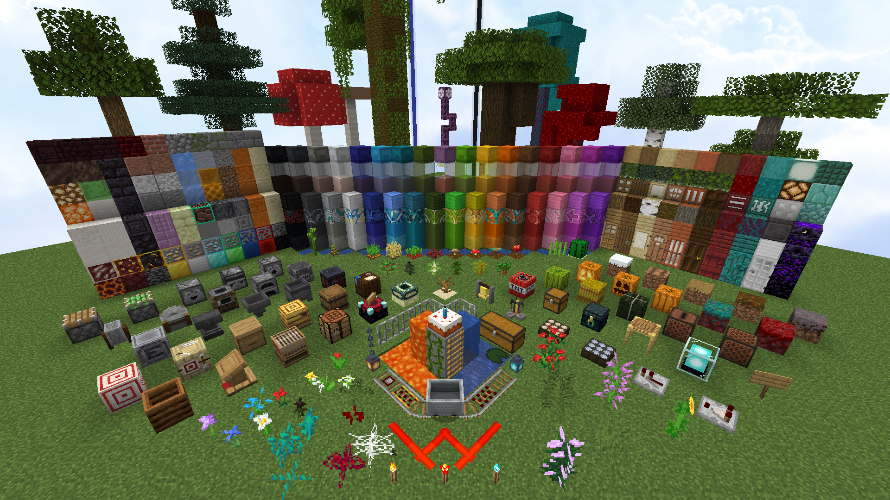

# 🧱 Carbonated Default
📖 **Description:** Carbonated Default is a Minecraft resourcepack which inherits the default look and feel and tries to better the overall player experience with many QoL improvements. It is meant to be used both in survival and multiplayer.

❗ **Important:** Though it can be used without it without any major issue, it is recommended to download & install [Optifine](https://optifine.net/downloads) in order to achieve the full experience!

## 🏆Features: 
- Features a 1.8 version and being updated to the latest Minecraft releases!
- Custom blocks & items!
- Replaced some textures with old ones for an extra nostalgia touch!
- Custom GUIs/UIs!
- Custom colormap!*
- Custom models!
- Less obstrusive overlays!
- Fullbright!
- Various redstone and mapmaking improvements and aids!
- A very cool and smooth font!
- Custom panorama based in the legendary pack.png!
- And many more!

*remove the "-" from assets/minecraft/textures/-colormap in the resourcepack folder

## 📦 [Download](https://github.com/Neutrovertido/Carbonated-Default/releases/latest):
📣 **Note:** The resource pack itself has been in development for several years, taking many names and for many versions. However only those worthy of being released to the public are going to be featured.

- [**Release 1.0**](https://github.com/Neutrovertido/Carbonated-Default/releases/tag/1.0): Features 1.8 and 1.16.2 versions
- [**Release 2.0**](https://github.com/Neutrovertido/Carbonated-Default/releases/tag/2.0): Features 1.8 and 1.17 versions
- [**Release 2.1**](https://github.com/Neutrovertido/Carbonated-Default/releases/tag/2.0): Features 1.17 and 1.18 versions (1.8 didn't require an update)

## 🔖 Credits:
Many thanks to the direct and/or indirect contributors that made this pack possible.
- [Neutrovertido](https://github.com/Neutrovertido/) (Original creator)
- [JAPPA](https://twitter.com/JasperBoerstra) (Lead Artist of Minecraft)
- [TimeDeo](https://www.youtube.com/c/TimeDeo) (Base 1.8 texture pack creator)
- [Vanilla Tweaks Team](https://vanillatweaks.net) (Amazing aesthetic, utility and visual fix resources creators)
- [D3SG4MER24](https://www.curseforge.com/members/d3sg4mer24/projects) (Shield corrections and coloring)

🎯 If you noticed the filename being full of periods, that is because GitHub doesn't allow for some characters to be used in the attached filenames, so feel free to rename it however you want. Recommendation: `§c1.18 §dCarbonated §eDefault §c[x16] §6v2.1`
